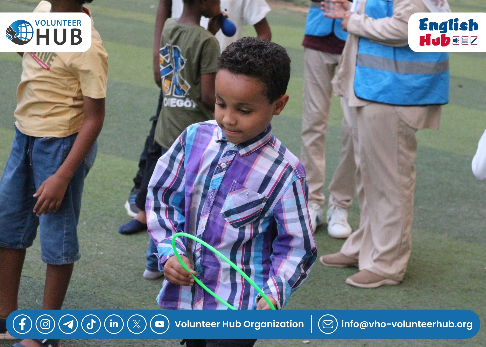

# VHO Media Assistant Bot 📸🤖

A smart Telegram bot built with Python to automate photo processing, framing, and team media management. 

## 🌟 Features
* **Automated Image Framing:** Smart overlaying of event photos onto various organization and club frames using the `Pillow` library.
* **AI-Powered Photo Editing:** Enhance lighting, adjust colors, and programmatically remove backgrounds via integration with the `Cloudinary API`.
* **Strict Access Control (Whitelist):** Access is restricted exclusively to authorized users by dynamically reading IDs from an `allowed_users.txt` file—eliminating the need for server restarts.
* **Webhook & Flask:** Operates with high efficiency on a live server (PythonAnywhere) using webhooks.

## 🛠️ Tech Stack
* **Language:** Python 3
* **Core Libraries:** `pyTelegramBotAPI` (Telebot), `Flask`, `Pillow`, `requests`
* **Cloud Services:** Cloudinary (Image Processing), PythonAnywhere (Hosting)

## 🚀 How to Run Locally

1. Clone the repository:
   ```bash
   git clone [https://github.com/mizomohamed10/VHO-media-bot.git](https://github.com/mizomohamed10/VHO-media-bot.git)

2. Install the required libraries:
   ```bash
   pip install -r requirements.txt

3. Add your secret API keys and tokens to the configuration parameters in the code.

4. Add your Telegram User ID to the allowed_users.txt file.
5. Run the application.


## 📸 Demo / Before & After

| Before Framing | After Framing |
| :---: | :---: |
|  |  |
